# 登录页面

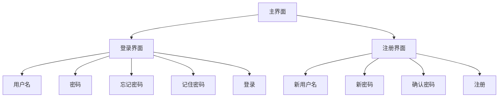

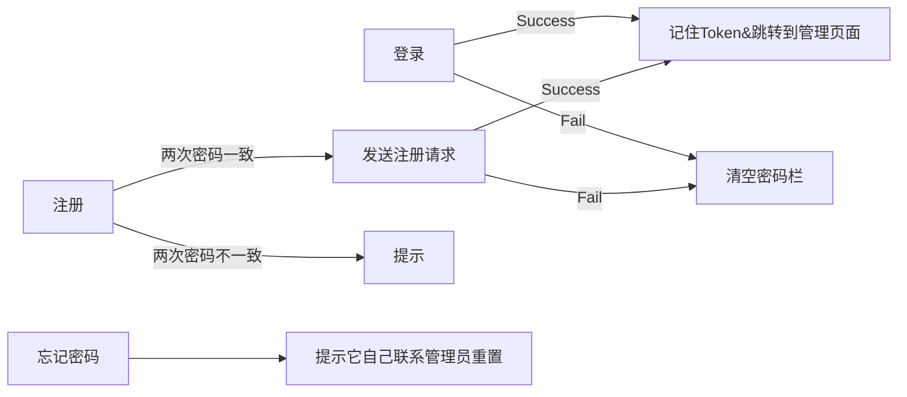

可选前端实现：自动登录和记住密码

# 个人信息页面

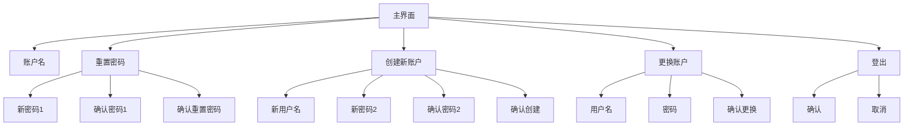

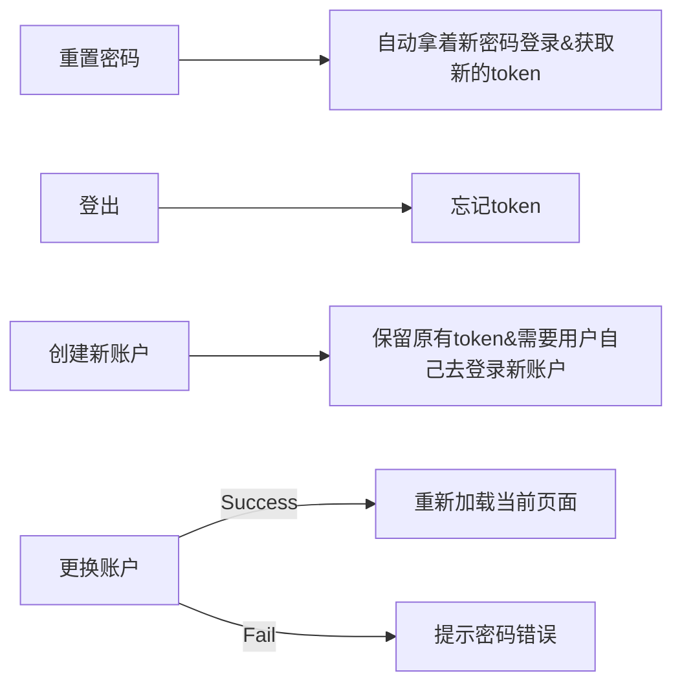

# 系统管理页面

## 分配合同

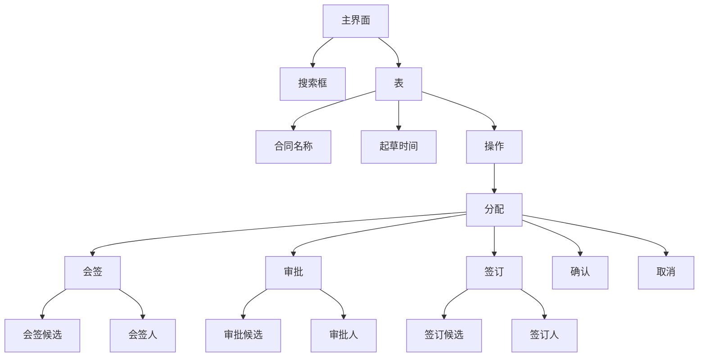

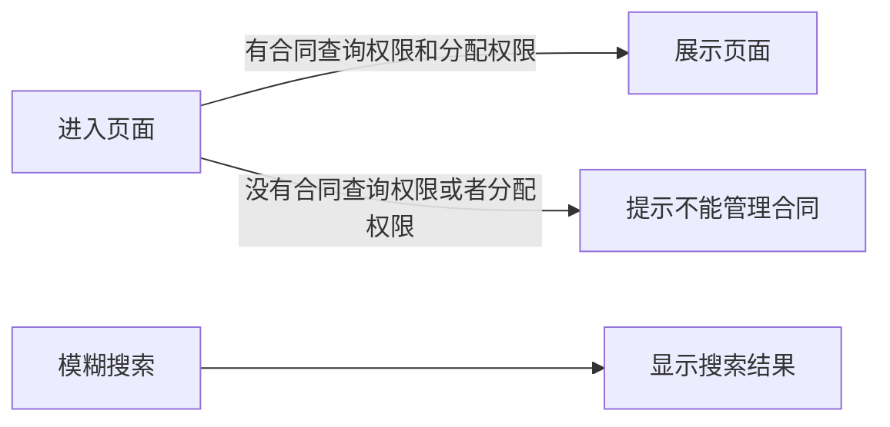

## 权限管理

### 用户管理

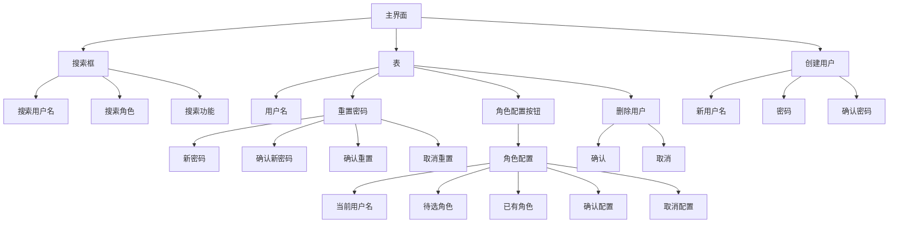

### 角色管理

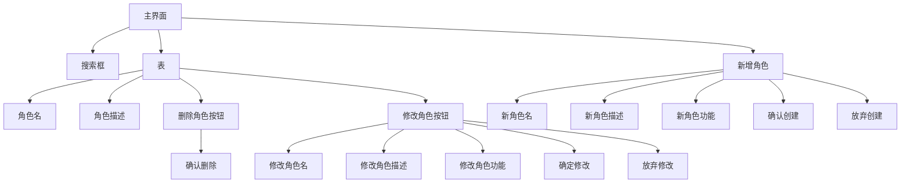

### 角色分配

参考用户管理

### 功能管理

其实功能是固定的

# 起草合同页面

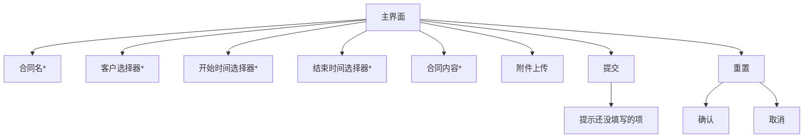

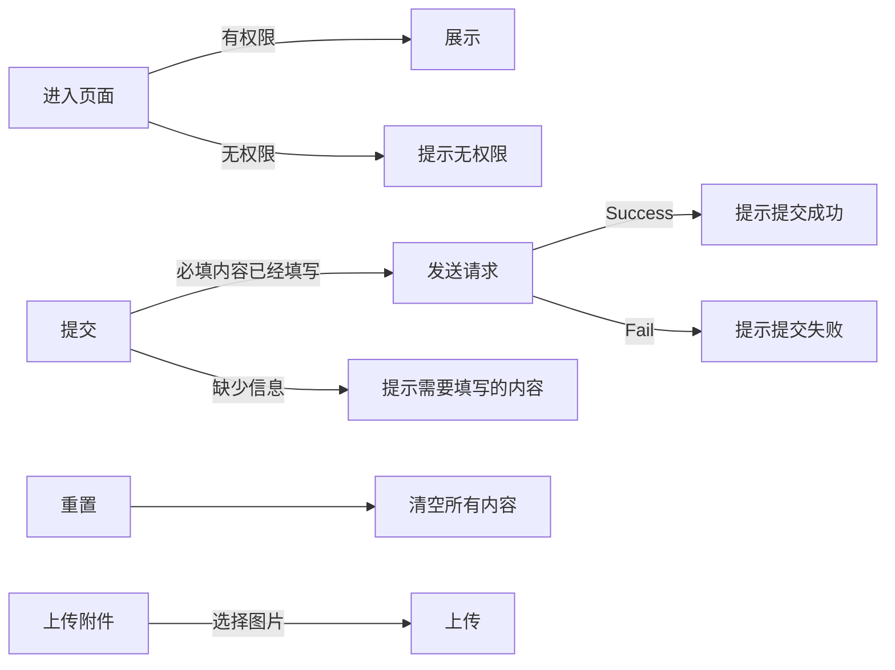

# 会签管理页面

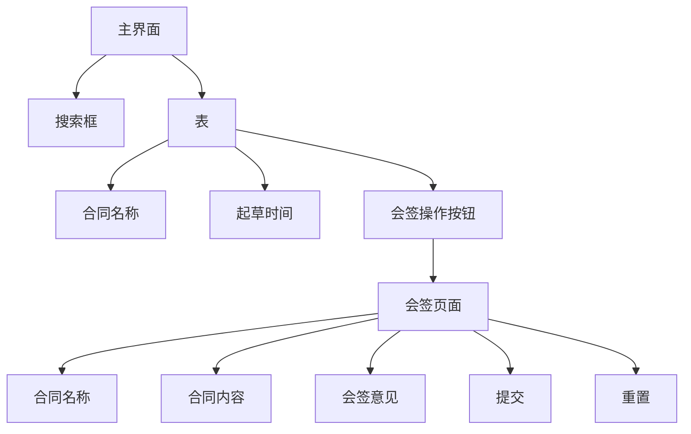

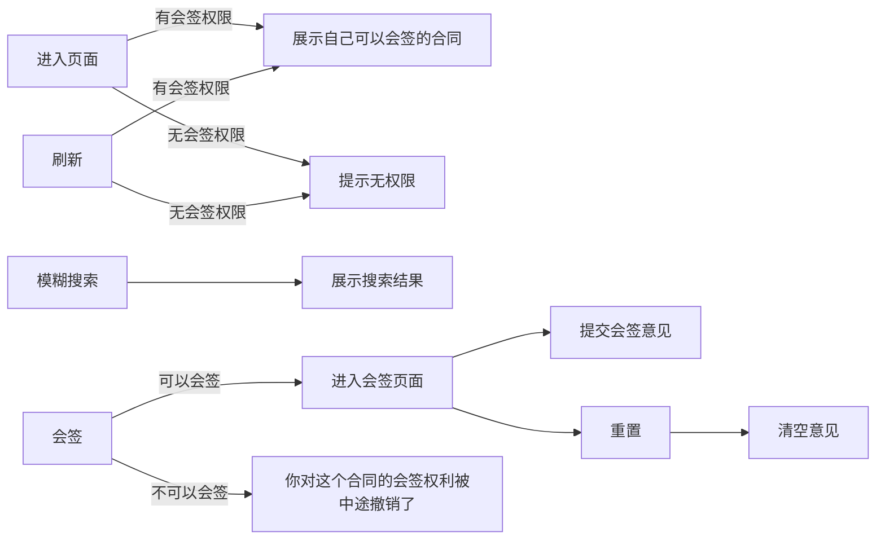

# 定稿合同页面

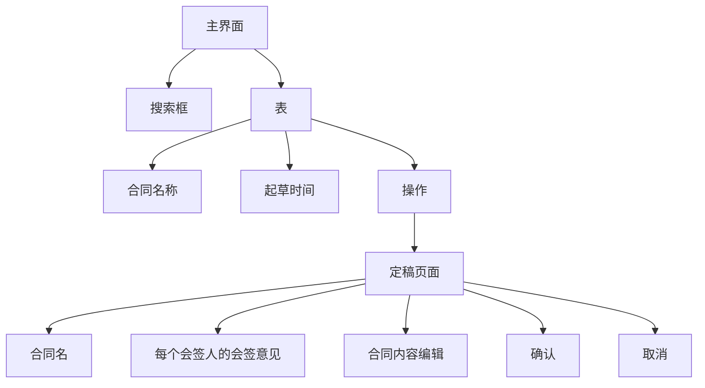

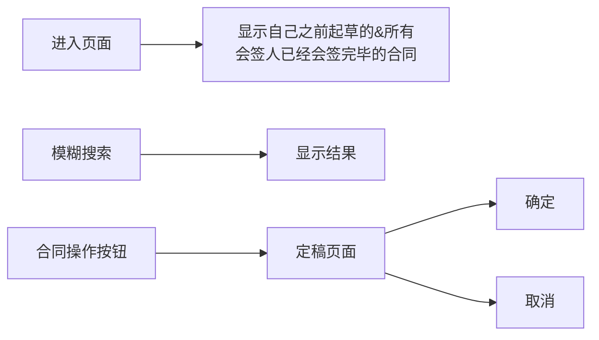

# 审批合同页面
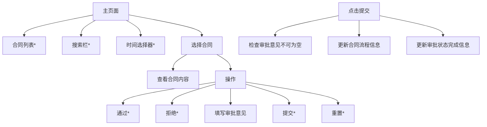

# 签订合同页面
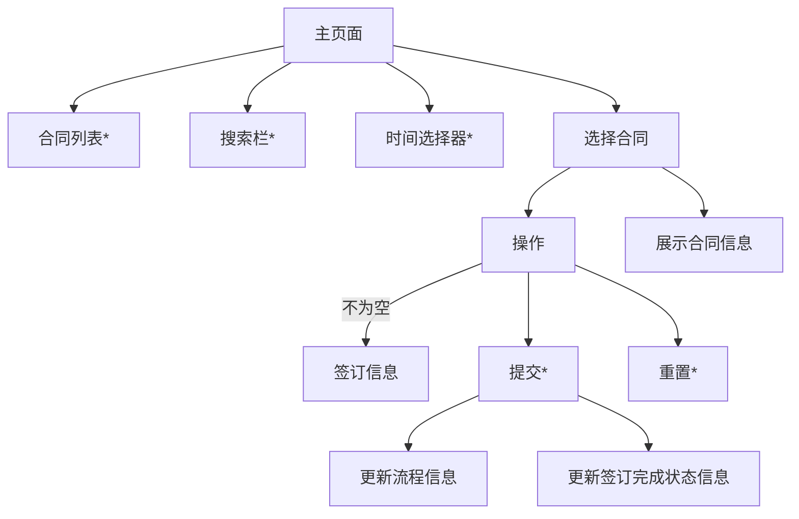
