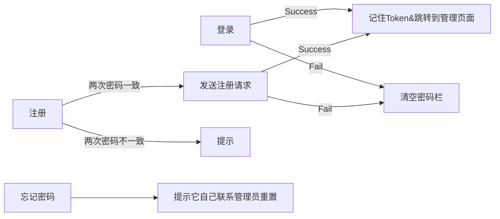
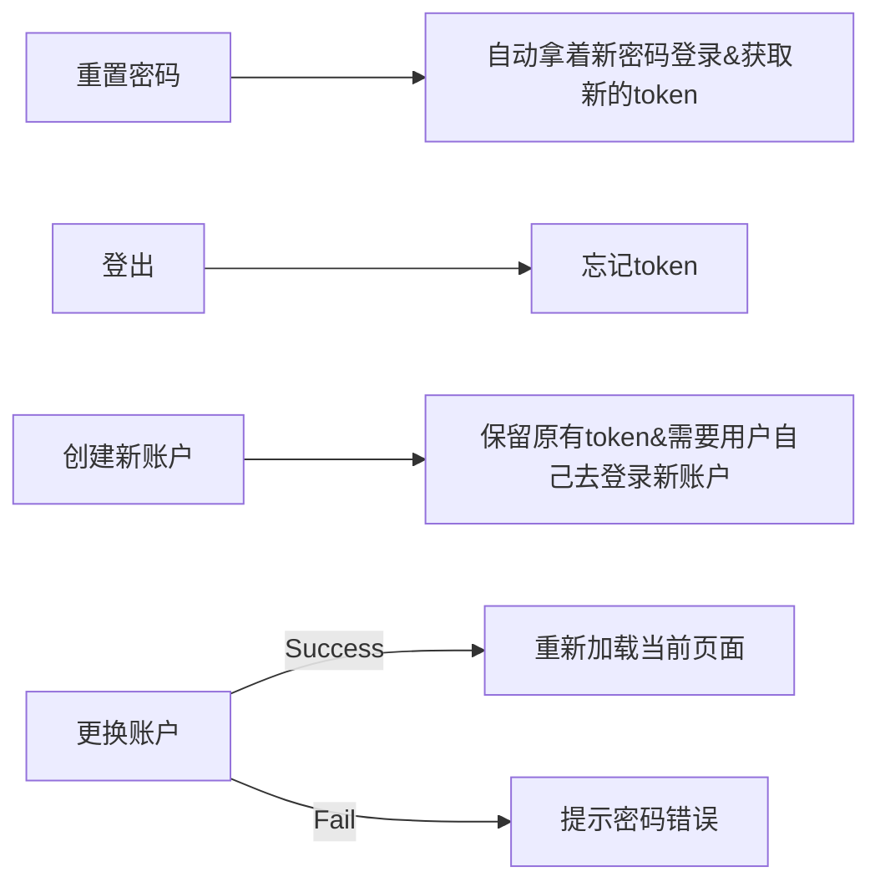
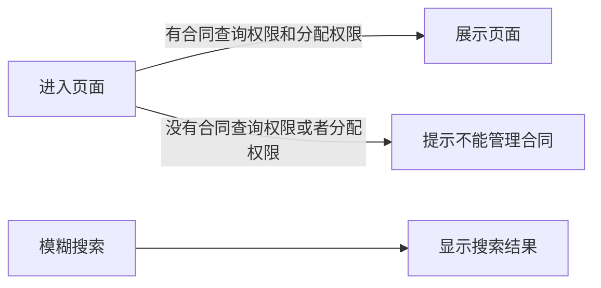
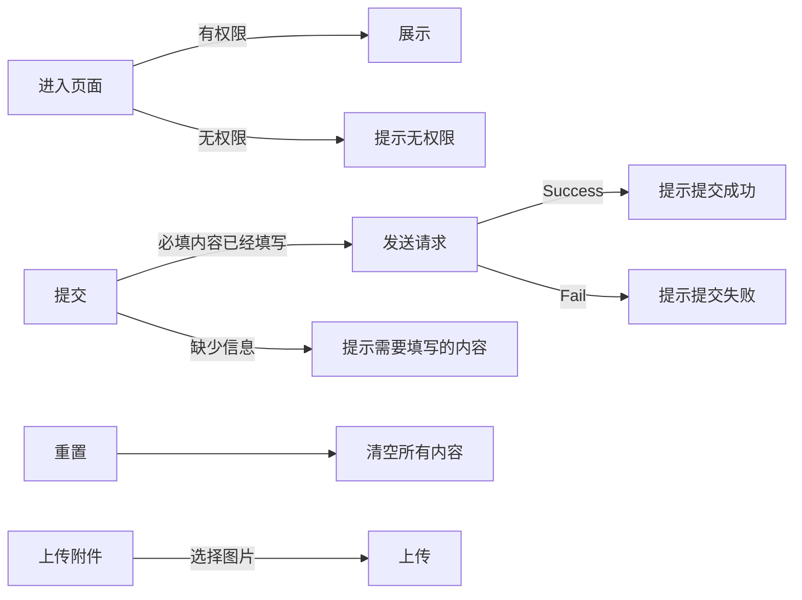
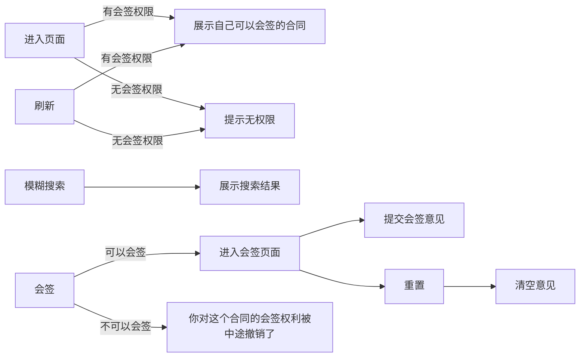

# 登录页面

```mermaid
graph LR;
signIn[登录]-->|Success|token&redirect[记住Token&跳转到管理页面];
signIn-->|Fail|清空密码栏;
signUp[注册]-->|两次密码一致|sendSignUpRequest[发送注册请求];
signUp-->|两次密码不一致|提示;
sendSignUpRequest-->|Success|token&redirect;
sendSignUpRequest-->|Fail|清空密码栏;
forgetPassword[忘记密码]-->提示它自己联系管理员重置;
```

可选前端实现：自动登录和记住密码

# 个人信息页面

```mermaid
graph LR;
resetPassword[重置密码]-->login[自动拿着新密码登录&获取新的token];
logout[登出]-->forgetToken[忘记token];
createNewAccount[创建新账户]-->createUser[保留原有token&需要用户自己去登录新账户];
changeAccount[更换账户]-->|Success|reload[重新加载当前页面];
changeAccount-->|Fail|hint[提示密码错误];
```

# 系统管理页面

## 分配合同

```mermaid
graph LR;
enter[进入页面]-->|有合同查询权限和分配权限|show[展示页面];
enter-->|没有合同查询权限或者分配权限|提示不能管理合同;
模糊搜索-->显示搜索结果;
```

# 起草合同页面

```mermaid
graph LR;
enter[进入页面]-->|有权限|show[展示];
enter-->|无权限|提示无权限;
submit[提交]-->|必填内容已经填写|request[发送请求];
submit-->|缺少信息|提示需要填写的内容;
request-->|Success|提示提交成功;
request-->|Fail|提示提交失败;
reset[重置]-->清空所有内容;
upload[上传附件]-->|选择图片|上传;
```

# 会签管理页面

```mermaid
graph LR;
enter[进入页面]-->|有会签权限|show[展示自己可以会签的合同];
enter-->|无会签权限|noPermission[提示无权限];
refresh[刷新]-->|有会签权限|show;
refresh-->|无会签权限|noPermission;
search[模糊搜索]-->展示搜索结果;
counter_sign[会签]-->|可以会签|enter_counter_sign[进入会签页面];
counter_sign-->|不可以会签|你对这个合同的会签权利被中途撤销了;
enter_counter_sign-->提交会签意见;
enter_counter_sign-->重置-->清空意见;
```

